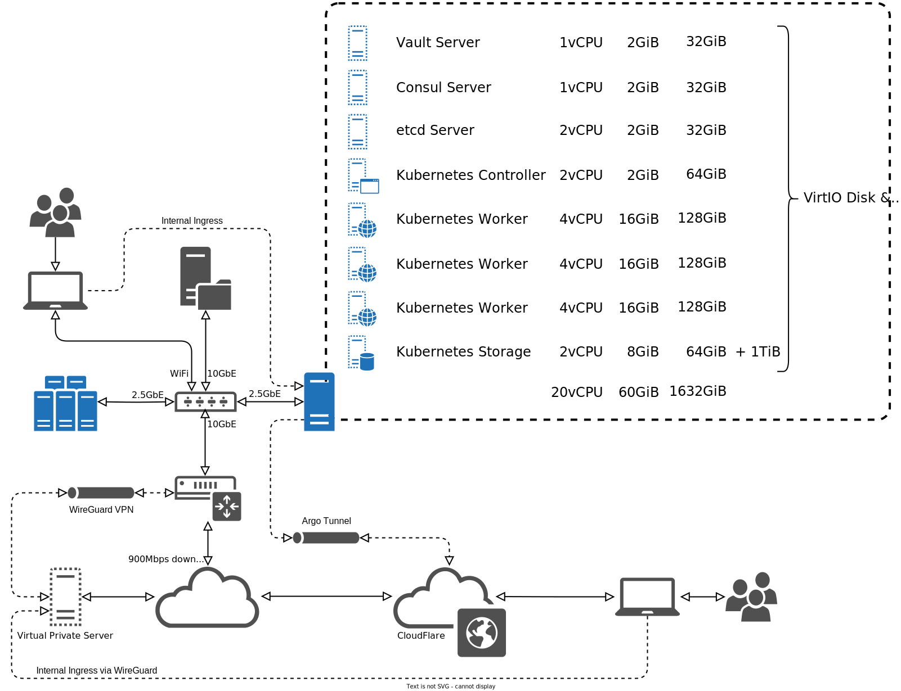

The `n3tuk` Organisation is a central organisation within GitHub for the
management and development of the infrastructure for `n3t.uk`, the personal and
development infrastructure for Jonathan Wright
([`@jonathanio`][github-jonathanio] on GitHub), which includes:

[github-jonathanio]: https://github.com/jonathanio

- Privately-hosted [Kubernetes Cluster][kubernetes] on [Intel NUCs][hardware];
- [Cloudflare DNS][cloudflare-dns], [Pages][cloudflare-pages], and [Zero-Trust
  networking][cloudflare-zero-trust];
- [AWS Accounts and Services][aws]; and
- Testing and development applications and services.

[kubernetes]: https://kubernetes.io/
[cloudflare-dns]: https://www.cloudflare.com/dns/
[cloudflare-pages]: https://pages.cloudflare.com/
[cloudflare-zero-trust]: https://www.cloudflare.com/zero-trust/
[aws]: https://aws.amazon.com/

[hardware]: 

## Components

The following components used are to build and develop this infrastructure:

- [`ansible`][github-ansible]: An [`ansible`][ansible] repository for the
  [bootstrap][play-bootstrap] installation, [baseline][play-baseline] setup, and
  [management][play-all] of physical and virtual servers and their services,
  such as [`vault`][role-vault], [`consul`][role-consul], [`etcd`][role-etcd],
  and of [`kubernetes`][role-kubernetes] itself.
- `terraform`: Repositories based upon templates for [Terraform][terraform]
  [modules][modules] and [configurations][configurations], and kept up-to-date
  with the upstream repositories through a custom GitHub Action
  ([`action-synchronize-upstream`][action-synchronise]).

[ansible]: https://www.ansible.com/
[github-ansible]: https://github.com/n3tuk/ansible
[play-bootstrap]:
  https://github.com/n3tuk/ansible/blob/main/plays/bootstrap.yaml
[play-baseline]: https://github.com/n3tuk/ansible/blob/main/plays/baseline.yaml
[play-all]: https://github.com/n3tuk/ansible/blob/main/plays/all.yaml
[role-vault]: https://github.com/n3tuk/ansible/tree/main/roles/vault
[role-consul]: https://github.com/n3tuk/ansible/tree/main/roles/consul
[role-etcd]: https://github.com/n3tuk/ansible/tree/main/plays/roles/etcd
[role-kubernetes]: https://github.com/n3tuk/ansible/tree/main/roles/kubernetes
[terraform]: https://www.terraform.io
[modules]: https://github.com/n3tuk/template-terraform-module
[configurations]: https://github.com/n3tuk/template-terraform-configuration
[action-synchronise]: https://github.com/n3tuk/action-synchronise-upstream
